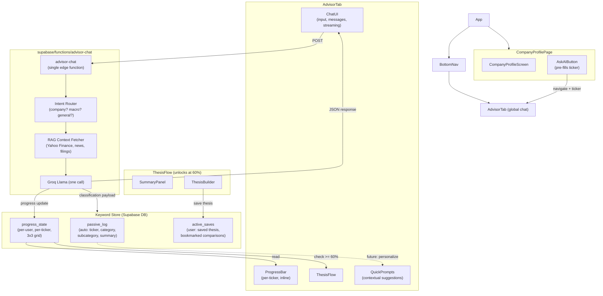

# Dependency Graph V1 — Global AI Advisor

Target architecture for migrating the company-specific AI advisor into the global advisor. This diagram describes a simplified, unified flow with a single backend and persistent Keyword Store.

---

## Architecture Diagram



---

## Layer Description

### App shell

- **App** — Root component
- **BottomNav** — Navigation; includes Advisor tab
- **CompanyProfilePage** — Company profile screen (CompanyProfileScreen)

### Entry points

- **AdvisorTab** — Global chat screen; reached from BottomNav
- **AskAIButton** — On CompanyProfileScreen; pre-fills ticker and navigates to AdvisorTab

### AdvisorTab (global chat)

| Component | Purpose |
|-----------|---------|
| **ChatUI** | Input, message list, streaming display |
| **QuickPrompts** | Contextual suggestion chips |
| **ProgressBar** | Per-ticker progress, inline |
| **ThesisFlow** | SummaryPanel + ThesisBuilder; unlocks when progress ≥ 60% |

### Backend — `advisor-chat` (single Edge Function)

| Component | Purpose |
|-----------|---------|
| **Intent Router** | Routes by intent: company? macro? general? |
| **RAG Context Fetcher** | Yahoo Finance, news, filings |
| **LLM** | Single Groq Llama call |

**Response structure:**

```json
{
  "response": "streamed to user",
  "classification": { "category": "...", "subcategory": "...", "summary": "..." },
  "suggested_questions": ["...", "...", "..."]
}
```

### Keyword Store (Supabase DB)

| Table | Purpose |
|-------|---------|
| **passive_log** | Auto: ticker, category, subcategory, summary (future: personalize QuickPrompts) |
| **active_saves** | User: saved thesis, bookmarked comparisons |
| **progress_state** | Per-user, per-ticker, 3×3 grid (understanding, risks, valuation) |

### Data flow

1. **ChatUI** → POST → **advisor-chat**
2. **advisor-chat** → Intent Router → RAG → LLM
3. **LLM** → streamed response + classification + suggested_questions → **ChatUI**
4. **LLM** → classification → **Keyword Store** (passive_log, progress_state)
5. **ThesisBuilder** → save thesis → **active_saves**
6. **ProgressBar** ← read ← **progress_state**
7. **ThesisFlow** unlocks when **progress_state** ≥ 60%
8. **PassiveLog** (future) → personalize → **QuickPrompts**

---

## Relation to Migration

This is the **target architecture** for migrating the company-specific AI advisor into the global advisor. See [COMPANY_AI.md](COMPANY_AI.md) for the current company advisor logic and [.cursor/plans/](.cursor/plans/) for the migration plan.
